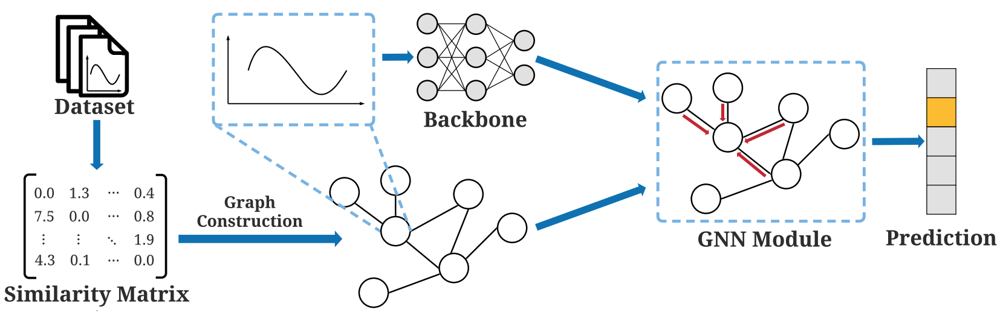

# SimTSC
This is the PyTorch implementation of SDM2022 paper [Towards Similarity-Aware Time-Series Classification](https://arxiv.org/abs/2201.01413). We propose Similarity-Aware Time-Series Classification (SimTSC), a conceptually simple and general framework that models similarity information with graph neural networks (GNNs). We formulate time-series classification as a node classification problem in graphs, where the nodes correspond to time-series, and the links correspond to pair-wise similarities.


## Installation
```
pip3 install -r requirements.txt
```

## Datasets
We provide an example dataset **Coffee** in this repo. You may download the full UCR datasets [here](https://www.cs.ucr.edu/~eamonn/time_series_data_2018/). Multivariate datasets are provided in [this link](https://drive.google.com/file/d/1obj8UI_H70PR5haQKQYnYVXyp8x-lWtC/view?usp=sharing).

## Quick Start
We use **Coffee** as an example to show how to run the code. You may easily try other datasets with arguments `--dataset`. We will show how to get the results for DTW+1NN, ResNet, and SimTSC.

First, prepare the dataset with
```
python3 create_dataset.py
```

Then install the python wrapper of UCR DTW library with
```
git clone https://github.com/daochenzha/pydtw.git
cd pydtw
pip3 install -e .
cd ..
```

Then compute the dtw matrix for **Coffee** with
```
python3 create_dtw.py
```

1. For DTW+1NN:
```
python3 train_knn.py
```

2. For ResNet:
```
python3 train_resnet.py
```

3. For SimTSC:
```
python3 train_simtsc.py
```

All the logs will be saved in `logs/`

## Multivariate Datasets Quick Start
1. Download the datasets and pre-computed DTW with [this link](https://drive.google.com/file/d/1obj8UI_H70PR5haQKQYnYVXyp8x-lWtC/view?usp=sharing).

2. Unzip the file and put it into `datasets/` folder

3. Prepare the datasets with
```
python3 create_dataset.py --dataset CharacterTrajectories
```

4. For DTW+1NN:
```
python3 train_knn.py --dataset CharacterTrajectories
```

5. For ResNet:
```
python3 train_resnet.py --dataset CharacterTrajectories
```

6. For SimTSC:
```
python3 train_simtsc.py --dataset CharacterTrajectories
```

## Descriptions of the Files

1. `create_dataset.py` is a script to pre-process dataset and save them into npy. Some important hyperparameters are as follows.
*   `--dataset`: what dataset to process
*   `--shot`: how many training labels are given in each class

2. `create_dtw.py` is a script to calculate pair-wise DTW distances of a dataset and save them into npy. Some important hyperparameters are as follows.
*   `--dataset`: what dataset to process

3. `train_knn.py` is a script to do classfication DTW+1NN of a dataset. Some important hyperparameters are as follows.
*   `--dataset`: what dataset we operate on
*   `--shot`: how many training labels are given in each class

4. `train_resnet.py` is a script to do classfication of a dataset with ResNet. Some important hyperparameters are as follows.
*   `--dataset`: what dataset we operate on
*   `--shot`: how many training labels are given in each class
*   `--gpu`: which GPU to use

5. `train_simtsc.py` is a script to do classfication of a dataset with SimTSC. Some important hyperparameters are as follows.
*   `--dataset`: what dataset we operate on
*   `--shot`: how many training labels are given in each class
*   `--gpu`: which GPU to use
*   `--K`: number of neighbors per node in the constructed graph
*   `--alpha`: the scaling factor of the weights of the constructed graph

